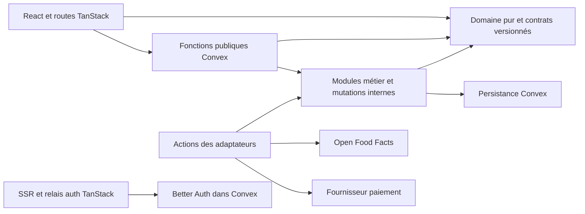
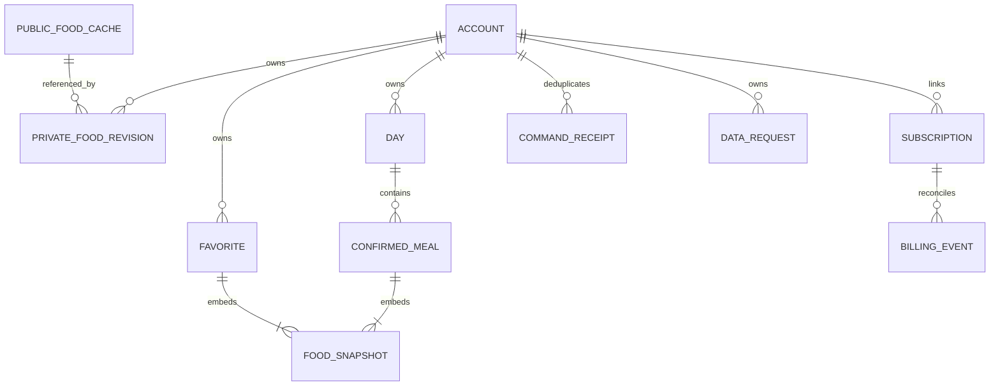
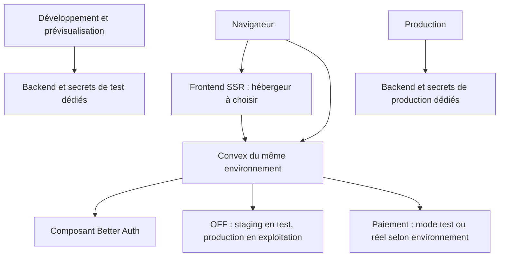

# Architecture — Macrova app

## Paradigme

Monolithe modulaire avec domaine pur partagé. Le contrat gouverne les fonctionnalités construites séparément. Le socle web et auth existe ; les modules métier ci-dessous constituent la cible à construire, pas des fonctionnalités déjà livrées.



Les flèches portent la direction des dépendances permises ; l’authentification du client Convex reste celle du socle existant.

## Invariants et règles

### AD-1 — Frontières et dépendances [ADOPTED]

- **Binds:** toutes les fonctionnalités.
- **Prevents:** Moteurs concurrents, écritures métier depuis le serveur web ou couplage du calcul à React.
- **Rule:** Le domaine TypeScript pur ne dépend ni de React, ni de Convex, ni du réseau. UI et fonctions Convex importent ce domaine ; les adaptateurs externes passent par des actions Convex. Convex est la seule autorité de persistance métier. TanStack Start assure pages, SSR et relais auth ; il ne détient ni base métier ni seconde logique de droits. Les tables auth appartiennent au composant Better Auth. Les modules catalogue, repas/journal, abonnement et demandes de données ont chacun un propriétaire ; leurs mutations exposent des commandes, jamais un accès générique aux tables.

### AD-2 — Calcul public et démonstration isolés [ADOPTED]

- **Binds:** CAP-1, CAP-2.
- **Prevents:** Profil gratuit enregistré implicitement et démo comptée comme usage personnel.
- **Rule:** Calculateur et démo utilisent le domaine en mémoire navigateur, sans compte ni persistance serveur du profil. Les exemples de démo sont des instantanés sourcés versionnés ; les données manquantes bloquent leur calcul. La méthode estimative doit être documentée et validée avant CAP-1 : en son absence, aucune estimation automatique. Une session démo ne peut appeler une confirmation personnelle ni produire un événement premier repas. Toute reprise personnelle exige compte, droit et confirmation explicite.

### AD-3 — Contrat nutritionnel canonique [ADOPTED]

- **Binds:** CAP-2 à CAP-6, catalogue et domaine.
- **Prevents:** Unités incompatibles, zéros inventés et modifications historiques par le catalogue.
- **Rule:** Le domaine possède un contrat FoodSnapshot versionné, partagé par démo, catalogue, correction privée et repas : identifiant source, nom, marque éventuelle, provenance et référence, date de consultation/saisie, état raw/cooked/unknown, base 100 g ou 100 ml, protéines/glucides/lipides en g et énergie en kcal, chacune chaîne décimale canonique non négative selon AD-12 ou null pour absence. La normalisation externe conserve le champ source et rend une ambiguïté de base explicite. Aucun calcul avec valeur null, aucun kcal inféré et aucune conversion ml/g sans densité sourcée. Les corrections privées sont des révisions appartenant au compte, séparées du cache OFF, et ne sont jamais publiées à OFF. Une ligne de repas embarque son instantané complet, sa révision, sa quantité, unité, bornes, pas et verrou ; le rafraîchissement catalogue ne le remplace jamais automatiquement.

### AD-4 — Un moteur de portions déterministe

- **Binds:** CAP-2, CAP-4, CAP-5.
- **Prevents:** Différences entre proposition client, confirmation serveur et affichage des écarts.
- **Rule:** Un même contrat SolverInput/SolverResult et un même module de domaine portent les règles de regles-repas.md : 3 à 6 aliments, cible P/G/L confirmée, pas/bornes/quantité initiale confirmés et verrou strict. [ADOPTED] Les règles produit et le moteur commun sont hérités. [ASSUMPTION] Les précisions d’ancrage de grille et de départage ci-après sont des arbitrages techniques proposés pour la bêta, à éprouver avec les portions réelles. La grille admissible est ancrée à zéro ; quantité, minimum et maximum sont des multiples exacts du pas, validés avant calcul. Le contrat numérique commun AD-12 s’applique ; aucune comparaison de flottants ne décide de l’admissibilité. Le classement utilise la moyenne des trois écarts absolus normalisés, puis la somme des variations absolues divisées par le pas de chaque ligne, puis l’ordre lexicographique des quantités selon les identifiants stables de lignes. Les totaux non arrondis servent au score et à la tolérance max(10 %, 2 g) ; l’arrondi concerne seulement l’affichage. Le serveur revalide la proposition et recalcule les totaux avant sauvegarde. SolverResult distingue proche, cible non atteinte, entrée invalide, données manquantes, contraintes incompatibles et recherche interrompue ; une limite de ressources ne prouve jamais l’impossibilité ou l’optimalité. Une modification des entrées invalide la proposition et sa confirmation. Chaque résultat porte la version du contrat et du moteur.

### AD-5 — Repas, favoris et journée sous une seule autorité [ADOPTED]

- **Binds:** CAP-5, CAP-6.
- **Prevents:** Sauvegardes doubles, favori ajouté automatiquement et bilan périmé.
- **Rule:** Le module repas/journal possède favoris, repas confirmés et journées. Copier/reprendre produit un nouveau brouillon en mémoire avec ses identifiants de lignes propres ; l’original demeure indépendant. La commande de confirmation reçoit un operationId stable par intention, réutilisé après panne, avec un condensat canonique du contenu ; la mutation transactionnelle indexe ownerId + operationId, retourne le résultat déjà acquis pour le même contenu et refuse la réutilisation avec un autre contenu. Une nouvelle intention reçoit une nouvelle clé. Favori et entrée du journal sont deux destinations explicites d’une même commande atomique, qui peut en créer une ou les deux. Toute mutation d’un repas/jour vérifie expectedRevision ; en conflit, demander relecture, sans écrasement silencieux. Les totaux sont dérivés des seuls repas confirmés non retirés. La journée détient un instantané de la cible journalière P/G/L/kcal confirmé explicitement, distinct de la cible du repas ; en son absence, aucun reste n’est calculé. Une modification de la cible courante du compte ne remplace pas les cibles historiques. Modifier explicitement la cible d’une journée incrémente sa révision et remet sa complétude à confirmer ; le reste de ce jour utilise exclusivement cet instantané. Une journée est identifiée par ownerId + date locale YYYY-MM-DD ; le fuseau IANA du compte guide la date proposée, la date choisie reste stable. Toute modification de repas remet la complétude à confirmer ; les restes négatifs restent visibles et ne déclenchent aucune compensation.

### AD-6 — Identité et autorisations serveur [ADOPTED]

- **Binds:** CAP-3 à CAP-8.
- **Prevents:** Accès intercomptes et paiement contourné par appel direct.
- **Rule:** Chaque fonction privée obtient l’utilisateur par authComponent.getAuthUser(ctx), dérive ownerId du compte Better Auth et contrôle la propriété de chaque référence reçue ; un ownerId fourni par le client ne fait jamais autorité. Les index privés sont préfixés par ownerId et les lectures par identifiant vérifient aussi le propriétaire. Les fonctions de composition personnelle, correction privée, favoris et journal exigent un droit actif vérifié dans Convex. Compte, abonnement, résiliation, export et suppression demeurent accessibles au propriétaire sans abonnement actif. Les fonctions internal ne sont pas accessibles au navigateur. Pendant une suppression, les écritures métier sont refusées. La garde SSR améliore le parcours mais ne remplace aucun contrôle backend.

### AD-7 — Paiement et droits réconciliables

- **Binds:** CAP-7 et mesures de paiement.
- **Prevents:** Accès donné par la page de retour, événements doublés ou ordre réseau assimilé à ordre métier.
- **Rule:** Le module abonnement possède la projection des droits ; seul son adaptateur fournisseur vérifie les événements signés sur corps brut et leur identifiant, puis rapproche le statut courant du fournisseur avec la souscription liée au compte. Lier le client fournisseur à ownerId côté serveur ; ne pas se fier à une adresse e-mail ni à un identifiant client soumis par le navigateur. Réception, déduplication et application atomique se font via mutations internes ; les événements sont conservés comme travail à réessayer jusqu’à rapprochement effectif. Les appels de création utilisent une clé idempotente ; une réconciliation planifiée répare les événements manqués. Chaque rapprochement réserve une génération croissante par souscription avant appel fournisseur ; la mutation d’application n’accepte que la génération encore courante et vérifie dans sa transaction que le compte n’est pas fermé. Une observation ancienne est abandonnée et un échec de la génération courante relance le travail avec une nouvelle génération ; aucune réponse concurrente obsolète ne peut restaurer un droit. La redirection après paiement affiche en attente jusqu’à confirmation backend et ne donne aucun droit. Le contrat des droits porte enabled et validUntil contrôlés à chaque opération : l’absence de statut confirmé refuse l’accès personnel. Offre unique de test 599 centimes EUR par mois ; aucune autre offre implicite. [ASSUMPTION] Stripe Checkout/Billing et portail client sont l’adaptateur initial proposé. La correspondance des statuts, l’effet de résiliation, les remboursements et la grâce éventuelle doivent être approuvés avant activation du paiement public ; aucune durée n’est inventée.

### AD-8 — Un adaptateur Open Food Facts centralisé

- **Binds:** CAP-3 et exemples CAP-2.
- **Prevents:** Quotas multipliés par utilisateur et cache pollué par données privées.
- **Rule:** Les appels OFF sont exécutés uniquement par l’adaptateur catalogue côté Convex, avec User-Agent identifié et endpoints versionnés configurés après validation des champs nécessaires. Recherche sur soumission explicite ; aucune requête OFF à chaque frappe. Cache public indexé par requête normalisée, langue, filtres et version adaptateur ; résultats horodatés. Déduplication des requêtes simultanées et budget central séparé recherche/produit partagé par toutes les instances. Le budget par déploiement reste conservateur et plafonné aux quotas vérifiés ; il ne garantit pas un quota par IP si les sorties cloud sont partagées : en 429/503, suspendre, appliquer le délai fourni et afficher indisponibilité, sans boucle de retry. OFF indisponible et aucun résultat sont des états distincts ; un cache ancien est signalé. Aucun profil ou identifiant compte envoyé à OFF. Attribution et liens de provenance accompagnent toute donnée réutilisée ; images différées. Les corrections privées et données de journal ne rejoignent jamais ce cache. Licence et conditions de diffusion d’une base dérivée restent une condition d’ouverture, non une conformité présumée.

### AD-9 — Export et suppression comme travaux durables

- **Binds:** CAP-8, auth, repas/journal et abonnement.
- **Prevents:** Suppression annoncée avant achèvement ou données recréées par webhook.
- **Rule:** Le module demandes de données possède les demandes export/delete et les états queued/running/failed/completed, avec reprise idempotente et progression vérifiable. Export paginé portant une version du format, période de collecte et manifeste ; l’accès est privé, limité dans le temps et révocable. La suppression exige confirmation distincte, clôt les écritures métier, traite la souscription externe, les instantanés, corrections, journées, favoris, événements identifiants et exports, puis retire le compte et révoque les sessions via les API du composant. La demande et la programmation initiale du travail sont enregistrées dans une mutation atomique. Le travail durable est interne et peut terminer après révocation ; il reçoit seulement requestId et relit son propriétaire enregistré, jamais une session supposée. Chaque lot enregistre sa progression et programme la suite ; une supervision relance les travaux bloqués/échoués selon leur clé idempotente, sans supposer un retry automatique des actions planifiées. Toute transaction interne susceptible de créer ou modifier une donnée personnelle, notamment cache privé, export et rapprochement paiement, relit la fermeture du compte dans la même transaction et refuse la recréation ; le travail de suppression ne peut que nettoyer et avancer son état. La fermeture durable est créée avant nettoyage et survit aux consommateurs externes encore actifs selon la politique approuvée. Les informations minimales empêchant la recréation, la conservation légale, le nettoyage des sauvegardes et les délais sont soumis à une politique approuvée avant ouverture ; aucune suppression totale annoncée tant que son périmètre effectif ne l’autorise. Le calcul gratuit ne dépend pas de ce travail.

### AD-10 — Environnements, exploitation et évolution

- **Binds:** ensemble du système.
- **Prevents:** Prévisualisation branchée en production, secrets publics et migration détruisant les instantanés.
- **Rule:** Séparer développement/test et production : déploiements Convex, origines autorisées, secrets et mode paiement distincts ; les prévisualisations utilisent un backend de test dédié et aucune donnée réelle. Les secrets restent côté serveur, jamais dans VITE_*. Installation reproductible depuis bun.lock ; backend compatible publié avant frontend ; les migrations introduisent d’abord des champs compatibles et une version, font un backfill reprenable puis retirent les anciens champs après retrait des consommateurs. Les lecteurs historiques conservent la prise en charge des versions d’instantané présentes. Pas de sauvegarde optimiste annoncée réussie avant accusé backend, ni file hors ligne implicite ; reconnexion relit état et operationId. Les métriques suivent échecs de mutation, quotas OFF, latence du moteur, retard de rapprochement paiement et échecs export/delete, sans payload nutritionnel, secret ni e-mail dans les logs. Alertes, sauvegarde/restauration exercée, coûts et régions doivent être définis avant ouverture publique. Le choix de l’hébergeur frontend reste ouvert ; il doit exécuter SSR et relais auth TanStack Start avec les URL Convex cohérentes.

### AD-11 — Mesures produit privées et sémantiques [ADOPTED]

- **Binds:** protocole-validation.md et CAP-2, CAP-5, CAP-7.
- **Prevents:** Démo, connexion ou retour de paiement comptés comme validation commerciale.
- **Rule:** Les événements personnels sont émis côté serveur après mutation effective, avec eventId et déduplication ; first_personal_meal, meal_reused et payment_settled ont une définition unique dans le contrat partagé. first_personal_meal exige un repas personnel confirmé enregistré en favori ou au journal ; meal_reused conserve une filiation de copie/reprise et exige son enregistrement confirmé dans au moins une de ces destinations. Une commande enregistrant les deux destinations ne compte qu’une fois. La démo n’émet aucun de ces événements. La cohorte conserve invitationAt pour chaque invité, y compris sans usage ; les fenêtres J6 à J8 et les dénominateurs suivent protocole-validation.md. Les paiements réellement encaissés sont distincts du droit actif ; remboursements et renouvellements sont rapprochés séparément. calculator_completed et demo_completed sont des mesures publiques distinctes, sans contenu du profil ni confusion avec activation personnelle ; les données de mesure personnelles sont incluses dans le périmètre export/delete selon la politique approuvée. Aucun traqueur tiers imposé.

### AD-12 — Représentation numérique commune

- **Binds:** catalogue, domaine, démo, UI, confirmations et totaux.
- **Prevents:** Précisions différentes, arrondis de source cachés et départages dépendant du runtime.
- **Rule:** [ASSUMPTION] Contrat v1 : toute quantité, macro, kcal, densité et cible est une chaîne décimale canonique non exponentielle, sans séparateur local, avec au plus six décimales et une valeur comprise entre 0 et 1 000 000 ; le pas et la densité doivent être strictement positifs. Une saisie française est normalisée avant validation ; une source excédant précision ou plafond est signalée non prise en charge, jamais arrondie silencieusement. Le domaine convertit ces chaînes en entiers BigInt à échelle 10^6, absents du transport JSON. Produits, divisions, scores et comparaisons restent rationnels exacts jusqu’à affichage ; les adaptateurs et validateurs utilisent ce même contrat. L’affichage arrondit au centième avec demi supérieur et conserve la valeur exacte dans les commandes. Modifier ces limites exige une nouvelle version de contrat commune, pas une adaptation locale.

## Conventions de cohérence

| Sujet | Convention |
| --- | --- |
| Propriétaires | ownerId = identifiant utilisateur Better Auth ; références externes seulement dans leurs adaptateurs. |
| Contrats | Domaine et validateurs Convex partagent un schéma versionné ; aucune interface nutritionnelle redéfinie dans une route. Rejeter une version inconnue. |
| Identifiants | Identifiants Convex pour documents ; identifiants de lignes stables pour calcul ; operationId pour intentions de commande. |
| Temps | Horodatages UTC en millisecondes ; jour civil YYYY-MM-DD et fuseau IANA ; aucune déduction du jour à partir du fuseau serveur. |
| Erreurs | code stable, champs concernés, retryable ; texte français dans l’UI. Distinguer absence, accès refusé, conflit et indisponibilité. |
| Brouillon | Un seul état Composition par session et parcours, partagé entre recherche, bilan et confirmation ; retour préserve les saisies. Toute nouvelle entrée invalide le résultat. UI seule propriétaire du brouillon, Convex seule propriétaire du confirmé. |
| Révision | expectedRevision sur modifications ; nouvelle lecture et nouvelle confirmation après conflit. |
| UX commune | DESIGN.md et EXPERIENCE.md restent les contrats partagés : français, décimales françaises normalisées sans arrondi caché, saisies conservées en session active, offre après démonstration complète et états accessibles ; vérifier leur objectif WCAG 2.2 AA à l’implémentation. |
| Nutrition | null représente absence ; g/ml explicites ; énergie kcal ; afficher état inconnu et provenance ; valeurs arrondies jamais réutilisées comme entrées de calcul. |

## Stack

Photographie des versions **résolues dans app/bun.lock**, vérifiée le 5 octobre 2026. Le code possède ensuite cette liste ; ce document n’impose aucune mise à niveau.

| Name | Version |
| --- | --- |
| React | 19.3.0 |
| TanStack Start | 1.168.60 |
| TanStack Router | 1.170.41 |
| Convex | 1.46.0 |
| Composant Convex Better Auth | 0.12.5 |
| Better Auth | 1.6.15 |
| TypeScript | 6.0.3 |
| Vite | 8.3.2 |
| Tailwind CSS | 4.3.3 |

## Structure initiale

Les namespaces sont une amorce ; les frontières AD-1 et les propriétaires sont le contrat durable.

```text
app/
  src/domain/        contrats, nutrition, portions, totaux — à créer
  src/features/      parcours publics et personnels — à créer
  src/routes/        pages et relais auth — existant
  src/lib/auth-*     pont Better Auth — existant
  convex/auth.ts     authentification — existant
  convex/schema.ts   schéma métier vide à ce jour
  convex/catalog/    normalisation, cache, corrections — à créer
  convex/meals/      favoris, confirmations et journées — à créer
  convex/billing/    droits et rapprochement fournisseur — à créer
  convex/privacy/    export et suppression — à créer
```



FOOD_SNAPSHOT représente une valeur embarquée autonome, pas une table partagée modifiée par le catalogue. Les identifiants source survivent même si le cache est évincé.



[ASSUMPTION] Convex cloud est la cible backend du socle. Aucun compte, hébergement ni déploiement n’est créé par ce travail.

## Capacités et architecture

| Capacité | Responsable | Règles |
| --- | --- | --- |
| CAP-1 | Calculateur public et domaine estimation | AD-1, AD-2, AD-10 |
| CAP-2 | Démo et domaine portions | AD-2, AD-3, AD-4, AD-11 |
| CAP-3 | Catalogue, adaptateur OFF, corrections privées | AD-3, AD-6, AD-8 |
| CAP-4 | Composition et domaine portions | AD-3, AD-4, AD-6, AD-12 |
| CAP-5 | Module repas/journal | AD-3, AD-4, AD-5, AD-6 |
| CAP-6 | Module repas/journal et domaine totaux | AD-5, AD-6 |
| CAP-7 | Better Auth, abonnement et adaptateur paiement | AD-6, AD-7, AD-10, AD-11 |
| CAP-8 | Demandes de données et coordination des propriétaires | AD-6, AD-9, AD-10 |

## Décisions différées et conditions de reprise

| Sujet | Condition et effet |
| --- | --- |
| Méthode estimative, entrées et exclusions | Décision produit sourcée avant CAP-1 ; le module reste sans estimation automatique jusque-là. |
| Audit de 50 recherches et exemples sourcés | Avant gel du catalogue et démonstration chiffrée ; aucun catalogue complémentaire adopté. |
| Algorithme de recherche et budget CPU | Choix dans le module portions avant son implémentation, avec mesure des grilles réelles ; le contrat déterministe et l’état recherche interrompue sont déjà fixés par AD-4. |
| Limites numériques v1 | Précision et plafonds fixés par AD-12 comme hypothèses techniques ; tester sur l’audit alimentaire et les portions réelles, puis versionner une éventuelle évolution commune. |
| Paiement public | Adopter fournisseur et table statuts → droits, règles de résiliation/remboursement et conditions commerciales avant activation ; aucun accès présumé pendant cette définition. |
| Données et licences | Approuver périmètre, durées, délais, exceptions, traitement des sauvegardes et conditions OFF avant ouverture publique. Architecture ne certifiant aucune conformité. |
| Hébergement et exploitation | Choisir région/provider frontend et Convex, budget, alertes et procédure de restauration avant ouverture ; conserver séparation des environnements AD-10. |
| Auth de production | Définir vérification e-mail, récupération de compte et fournisseur d’envoi avant ouverture ; ces fonctions ne sont pas configurées dans le socle actuel. |
| Tables, index détaillés et URLs métier | Déduire des propriétaires et commandes ci-dessus à la construction ; aucun second propriétaire ni format partagé concurrent. |
| Mode hors ligne, application native, moteur de recherche externe | Hors périmètre initial ; réexaminer seulement sur besoin mesuré, sans sauvegarde silencieuse hors ligne. |

## Références techniques vérifiées

- [Intégration TanStack Start, Convex et Better Auth](https://labs.convex.dev/better-auth/framework-guides/tanstack-start).
- [Transactions Convex](https://docs.convex.dev/functions/mutation-functions) et [actions pour les effets externes](https://docs.convex.dev/functions/actions).
- [API Open Food Facts : versions, quotas et licences](https://openfoodfacts.github.io/openfoodfacts-server/api/).
- [Événements d’abonnement Stripe](https://docs.stripe.com/billing/subscriptions/webhooks) et [réception des webhooks](https://docs.stripe.com/webhooks), pour l’adaptateur proposé.
- [Hébergement TanStack Start](https://tanstack.com/start/latest/docs/framework/react/guide/hosting), sans fournisseur imposé.
